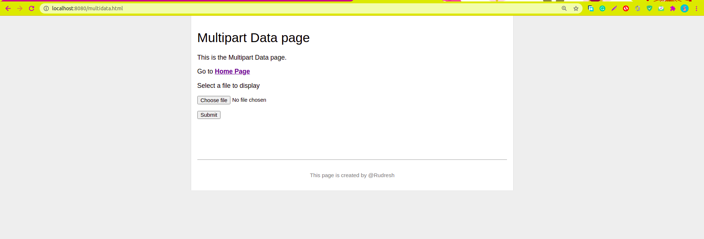

# HTTP SERVER in C++

## --- Problem Statement ---
Implement a basic HTTP server that supports HTTP/1.1 in C++.  
Requirements:  
    **->** Run on Linux  
    **->** Do not use any third party networking library, i.e. use only Linux system API.  
    **->** Handle at least 10,000 concurrent connections.  
    **->** Serve at least 100,000 requests per second on a modern personal computer.  
    **->** Serve a simple one or two pages website for demonstration.  
    **->** You may want to skip some trivial features like Multipart data if time is not enough,
       but you need to state clearly what features are supported.  

## --- Features ---  
**->** Created a two pages website easily managable by my local server.   
**->** The website supports the image display and we can move across the pages easily.  
**->** It also supports the Multipart/forms-data where we can choose a file and it will be displayed on the screen.  
**->** There is "Home" page having link to "Multipart-data" page which has the "FORM" option and a link to return to Home page.  
**->** Added a stylesheet, style.css which provides styling to the web pages.  
**->** Did not used any third party APIs, only used Linux system APIs.  
**->** Implemented the server code using TCP and HTTP classes that makes the code very neat and easy to understand.  
**->** Server code supports both "GET" and "POST" type of requests and responds accordingly.  
**->** Used POSIX threads and mutexes in both server and clients implemention to achieve concurrency.  
**->** Implemented poll functionality provided by Linux in the server code to handle multiple clients.  
**->** This method has significantly increased execution efficiency of a program and has advantages over threads, 
as it does not have a problem of dead locks and also the number of clients connected simultaneously is not bound.  
**->** Clients.cpp implementation supports 10,000 threads at a time with each thread sending and receiving 10 messages.  
**->** Server.cpp also supports 1000 threads so that the requests from multiple clients don't have to wait in queue and 
can be processed by any available server thread.  
**->** Thus, we are able to achieve 10,000 concurrent connections, and served 100,000 requests in less than one second.  
**->** The client code also handles unwanted disconnections due to time out. 
It will again send the same request if the client did not get the response from the server.

## --- Observation ---  
Total Concurrent Connections: 10,000  
Total Requests Sent and Received: 100,000      
Time (in sec): 0.796116  

## How to compile and run?  
**->** Open two terminals, one for clients and other for server.  
**->** Type "**make**" on any one terminal, this will compile both server.cpp and clients.cpp, 
and will create executables "**server**" and "**client**" respectively.  
**->** Firstly, type "**./server**" on one terminal, and then "**./client**" on the other.  
**->** The server and clients will begin to interact and the results will be displayed on the client terminal.  
**->** The client execution will be stopped gracefully, while the server will continue to run waiting for the next client connection.  
**->** To stop the server, type "**Ctrl + C**" in the server terminal.  

## Website demonstration:  
**->** As explained above, compile using **make** command.  
**->** In the terminal, and type "**./server**" and then open the google chrome and type http://localhost:8080    
**->** You will see the home page. Enjoy using the website!  

## Home page Image
  
## Multipart-data page Image

